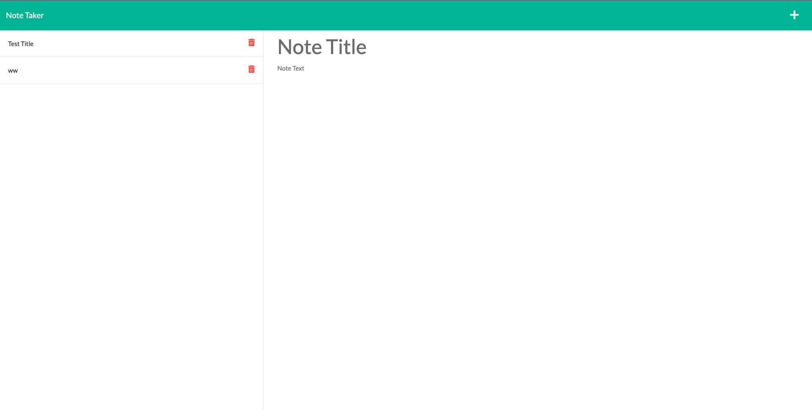

# note-taker
# Note-Taker-using-Express

My motivation behind this project was to build up my abilities in writing routes using Express.js. I used diffrent files to hold the different routes to keep my code clean.  Once I was able to figure this aspect of working with the backend out, I was able to make better progress on my project. 

## Description

This application uses Express.js routing that takes the user from a homepage to a note taking page. On the note taking page, the user is able to write a note with a title and details and save that note to page to reference to later.

## Installation

To launch the project, link on the link below. Type in a title for your note, then type in your note and click on the save button at the top right corner of the screen. This will append the note to the list on the left hand side of the page. 

https://sankyrajeev.github.io/note-taker-

## Usage

   md

  